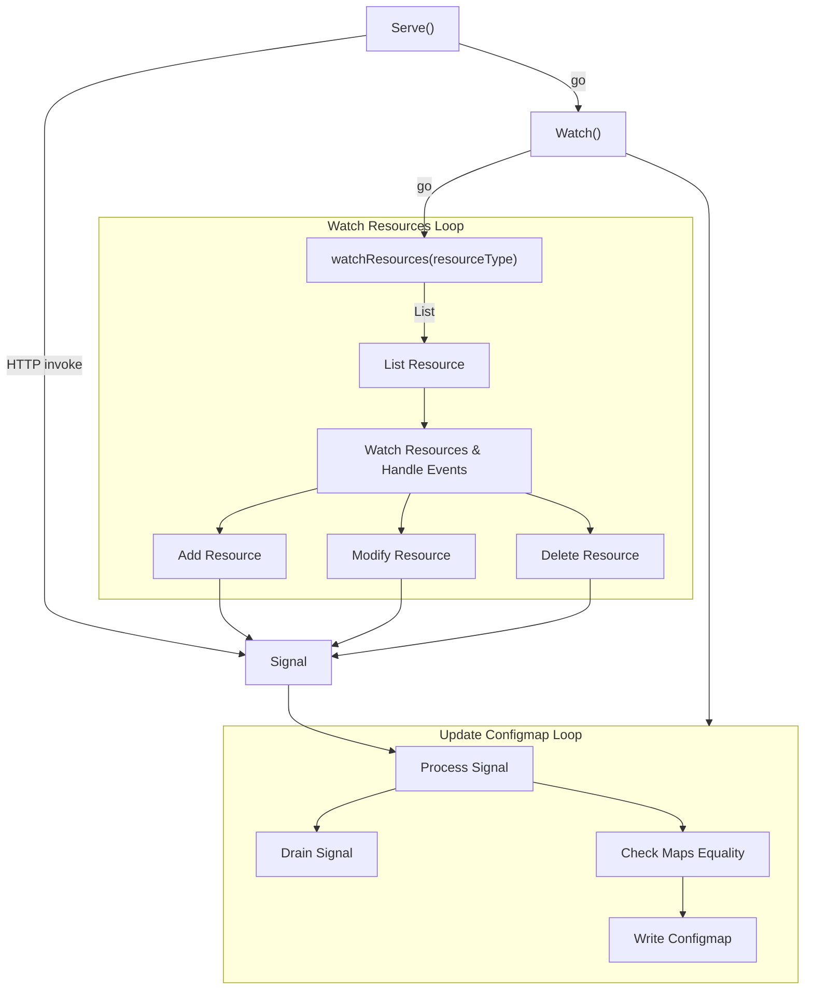

# Multena RBAC Collector


[](https://goreportcard.com/report/github.com/gepaplexx/multena-rbac-collector)
[](https://github.com/gepaplexx/multena-rbac-collector/releases/latest)


`multena-rbac-collector` is a Go program designed to retrieve all cluster/-roles, role bindings, and cluster role bindings from a Kubernetes cluster and process them for integration with `multena-proxy`.
This enables `multena-proxy` to make informed authorization decisions based on the fetched RBAC data.

## Installation

```bash
go get github.com/gepaplexx/multena-rbac-collector
```

## Key Features
- **Two Modes**:
    - **Run**: One-time collection of RBAC data.
    - **Serve**: Continuous collection of RBAC data, leveraging Kubernetes watch API.
- **ConfigMap Storage**: Use the `--cmName` and `--cmNamespace` flags to specify a ConfigMap in the cluster to store the RBAC data.
- **Local Output**: In the `run` mode, the YAML is also outputted as a local file.

## Usage
```
multena-rbac-collector [command]

Available Commands:
  completion  Generate the autocompletion script for the specified shell
  help        Help about any command
  run         Collects RBAC permissions and stores them in a ConfigMap
  serve       Starts continuous RBAC collection

Flags:
      --cmName string        in-cluster name of the ConfigMap to store the RBAC data
      --cmNamespace string   cluster namespace of the ConfigMap to store the RBAC data
      --config string        config file (default is $HOME/.multena-rbac-collector.yaml)
  -h, --help                 help for multena-rbac-collector
      --kubeconfig string    path to the kubeconfig file (default is $HOME/.kube/config for local development)
  -t, --toggle               Help message for toggle
```

## Serve mode



# Permissions for `multena-rbac-collector`

To run the `multena-rbac-collector`, you need to grant it the following permissions in your Kubernetes cluster:

## RBAC Authorization

- **RoleBindings**:
  - **API Group**: `rbac.authorization.k8s.io`
  - **Resources**: `rolebindings`
  - **Verbs**: `get`, `list`, `watch`

- **ClusterRoleBindings**:
  - **API Group**: `rbac.authorization.k8s.io`
  - **Resources**: `clusterrolebindings`
  - **Verbs**: `get`, `list`, `watch`

- **Roles**:
  - **API Group**: `rbac.authorization.k8s.io`
  - **Resources**: `roles`
  - **Verbs**: `get`, `list`, `watch`

- **ClusterRoles**:
  - **API Group**: `rbac.authorization.k8s.io`
  - **Resources**: `clusterroles`
  - **Verbs**: `get`, `list`, `watch`

## Core Resources

- **ConfigMaps**:
  - **API Group**: `""`
  - **Resources**: `configmaps`
  - **Verbs**: `get`, `create`, `update`

Please ensure that these permissions are correctly set before deploying the `multena-rbac-collector` to your Kubernetes environment.

You can find a sample `clusterrole` binding for these permissions at [this link](https://github.com/gepaplexx/gp-helm-chart-development/tree/main/infra/gp-multena/templates/rbac-collector/rbac.yaml).

## Deploying via Helm chart

the `multena-rbac-collector` can be deployed via the `gp-multena` Helm chart.
Desciption how to deploy Multena can be found [here](https://github.com/gepaplexx/multena-proxy?tab=readme-ov-file#deploy-multena).

To deploy the `rbac-collector` using the `gp-multena` Helm chart, ensure you set the following values:

```yaml
rbac-collector:
  enabled: true 
```

the helm chart can be found [here](https://github.com/gepaplexx/gp-helm-chart-development/tree/main/infra/gp-multena).

## Implementation Details

The package `server` provides the functionalities of serving endpoints `/healthz` for checking health and `/invoke` to manually trigger the RBAC data collection.

For continuously watching the RBAC changes in the Kubernetes cluster, the program leverages Kubernetes watch API. Upon detection of any changes, the RBAC data is processed, compared, and stored in the specified ConfigMap.

## Contributing

We welcome contributions! Please open an issue if you have any questions or suggestions.

## License

This project is licensed under the terms of the MIT license.