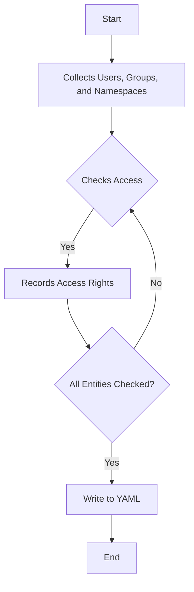

# Multena RBAC Collector


[](https://goreportcard.com/report/github.com/gepaplexx/multena-rbac-collector)
[](https://github.com/gepaplexx/multena-rbac-collector/releases/latest)


The `multena-rbac-collector` is a Go program that collects the Role-Based Access Control (RBAC) data from an OpenShift
cluster, specifically users and groups with their respective access to namespaces.



## Features

- Collects the list of all users, groups, and namespaces from an OpenShift cluster
- Checks access for each user and group to each namespace
- Outputs the collected data into a YAML file

## Prerequisites

- OpenShift cluster
- Configured `kubeconfig` file for accessing the cluster
- Cluster admin privileges for the user that runs the program

## Installation

Clone the repository and build using Go:

```bash
git clone https://github.com/gepaplexx/multena-rbac-collector.git
cd multena-rbac-collector
go build
```

## Usage

Simply run the compiled binary:

```bash
./multena-rbac-collector
```

This will create a `labels.yaml` file with the collected RBAC data.

## Contributing

We welcome contributions! Please open an issue if you have any questions or suggestions.

## License

This project is licensed under the terms of the MIT license.
